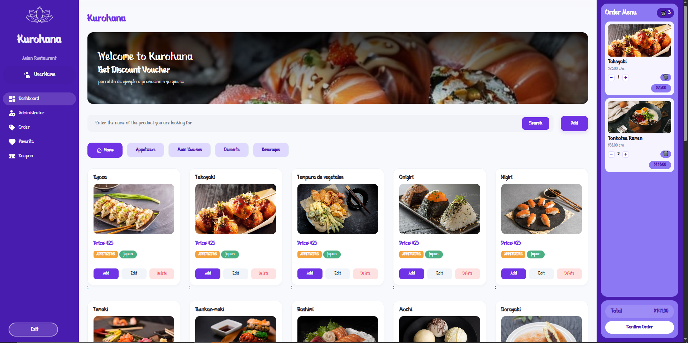

<p align="center">
  
  
  
  
  
</p>

# Kurohana SPA

<p align="center">
  
</p>

**Kurohana** es una Single Page Application para la gestión de un restaurante de cocina asiática. Permite administrar productos (platos), categorizarlos por tipo (entradas, platos principales, postres, bebidas) y gestionar pedidos a través de un carrito de compras interactivo.

---

## Funcionalidades

- **Autenticación** — formulario de registro e inicio de sesión con validación contra BD y hashing SHA-256 de contraseñas
- **Roles** — soporte para usuarios estándar y administradores con permisos diferenciados
- **CRUD de productos** — crear, editar y eliminar platos con nombre, precio, categoría, país de origen y foto
- **Filtrado por categorías** — filtra productos por Entradas, Platos principales, Postres o Bebidas
- **Búsqueda** — buscador en tiempo real por nombre de producto
- **Carrito de compras** — agrega productos, ajusta cantidades, aplica cupones y confirma pedidos
- **Panel de administrador** — interfaz exclusiva para gestionar productos y coupones
- **Configuración de perfil** — usuarios pueden actualizar username, email y contraseña
- **Historial de pedidos** — visualiza pedidos realizados y su estado
- **Cupones de descuento** — sistema de códigos promocionales (solo admin puede crear)
- **Persistencia** — todos los datos se almacenan via JSON Server

---

## Tecnologías

| Tecnología | Propósito |
|---|---|
| [Vite](https://vitejs.dev) | Bundler y dev server |
| [Tailwind CSS v4](https://tailwindcss.com) | Estilos utilitarios |
| JavaScript (Vanilla) | Lógica de la SPA (patrón MVC) |
| [JSON Server](https://github.com/typicode/json-server) | API REST falsa para desarrollo |
| [Bankai Font](https://www.dafont.com/bankai.font) | Tipografía personalizada de marca |

---

## Arquitectura

```
index.html
└── src/
    ├── main.js                 # Entry point — router SPA
    ├── middlewares/
    │   └── router.js           # Middleware de enrutamiento (hash-based)
    ├── views/
    │   ├── loginView.js        # Template HTML del login/registro
    │   ├── homeView.js         # Template del dashboard y carrito
    │   ├── adminitratorView.js # Template del panel admin
    │   ├── couponView.js       # Template de gestión de cupones
    │   ├── orderView.js        # Template de historial de pedidos
    │   └── settingView.js      # Template de configuración de perfil
    ├── controllers/
    │   ├── loginController.js   # Autenticación, registro y hashing SHA-256
    │   ├── homeController.js    # Renderizado, búsqueda, filtros y CRUD de productos
    │   ├── cartController.js    # Lógica del carrito (agregar, quitar, cantidades, total)
    │   ├── sidebarController.js # Navegación, logout y eventos del sidebar
    │   ├── adminController.js   # Lógica del panel administrador
    │   ├── couponController.js  # Gestión de cupones de descuento
    │   ├── orderController.js   # Visualización de pedidos
    │   └── settingsController.js # Actualización de perfil de usuario
    ├── components/
    │   ├── cartAdm.js           # Tarjeta de producto (vista admin)
    │   ├── cartUser.js          # Tarjeta de producto (vista usuario)
    │   ├── sidebar.js           # Sidebar con opciones por rol
    │   ├── modal.js             # Componentes de modales reutilizables
    │   └── pagination.js        # Paginación de productos
    ├── utils/
    │   └── utils.js             # fetchApiData, hashPassword
    ├── css/
    │   ├── style.css            # Estilos globales
    │   ├── login.css            # Estilos del login
    │   ├── modal.css            # Estilos de modales
    │   ├── carrito.css          # Estilos del carrito
    │   ├── sidebar.css          # Estilos del sidebar
    │   ├── stock.css            # Estilos de productos
    │   ├── responsive.css       # Media queries
    │   └── modal-order.css      # Estilos del modal de pedidos
    └── assets/
        ├── font/                # Tipografía Bankai
        └── img/                 # Logo, hero, fotos de productos

server/
└── json/
    └── productos.json           # BD con productos, usuarios y pedidos
```

---

## Requisitos

- Node.js 18+
- npm

---

## Setup

### 1. Clonar el repositorio

```bash
git clone https://github.com/YesRv/KUROHANA-SPA
cd Kurohana-SPA
```

### 2. Instalar dependencias

```bash
npm install
```

### 3. Iniciar JSON Server (API)

```bash
npx json-server .\server\json\productos.json
```

Esto levanta la API en `http://localhost:3000`.

### 4. Iniciar el frontend

```bash
npm run dev
```

Abre `http://localhost:5173` en tu navegador.

---

## Desarrollo

```bash
# Terminal 1 — API
npx json-server .\server\json\productos.json

# Terminal 2 — Frontend (Vite dev server)
npm run dev
```

---

## Producción

```bash
npm run build
```

Los archivos estáticos se generan en la carpeta `dist/`. Se pueden servir con cualquier servidor estático (Nginx, Vercel, Netlify, etc.).

---

## Scripts

| Comando | Descripción |
|---|---|
| `npm run dev` | Inicia el servidor de desarrollo Vite |
| `npm run build` | Compila para producción en `dist/` |
| `npm run preview` | Previsualiza la build de producción |

---

## Cuenta administradora

| Usuario | Contraseña |
|---|---|
| `Kurohana-Adm` | `123456` |

---

## Estructura de datos

### Productos
```json
{
  "id": 1,
  "name": "Ramen",
  "price": 55,
  "category": "mainCourses",
  "country": "japan",
  "url": "https://ejemplo.com/ramen.jpg",
  "pedidos": 0
}
```

### Usuarios
```json
{
  "id": 1,
  "username": "testuser",
  "email": "test@example.com",
  "password": "e3b0c44298fc1c149afbf4c8996fb92427ae41e4649b934ca495991b7852b855",
  "role": "user"
}
```

### Pedidos
```json
{
  "id": 1,
  "username": "testuser",
  "items": [
    { "id": 1, "nombre": "Ramen", "precio": 55, "cantidad": 2 }
  ],
  "total": 110,
  "paymentMethod": "cash",
  "status": "pending",
  "date": "2024-12-15"
}
```

### Cupones
```json
{
  "id": 1,
  "code": "DESCUENTO10",
  "discount": 10,
  "type": "percentage",
  "active": true
}
```

**Categorías de productos:** `appetizers`, `mainCourses`, `desserts`, `beverages`

**Países disponibles:** `japan`, `korea`, `china`

**Roles:** `user`, `admin`

---

## Notas

- El proyecto usa `localStorage` para mantener la sesión del usuario.
- Las contraseñas se hashean con **SHA-256** antes de guardarse en BD.
- El carrito se maneja en memoria (se pierde al recargar la página).
- JSON Server debe estar corriendo en `http://localhost:3000` para que la aplicación funcione correctamente.
- El rol `admin` otorga acceso a gestión de productos, cupones y visualización de todas las órdenes.
